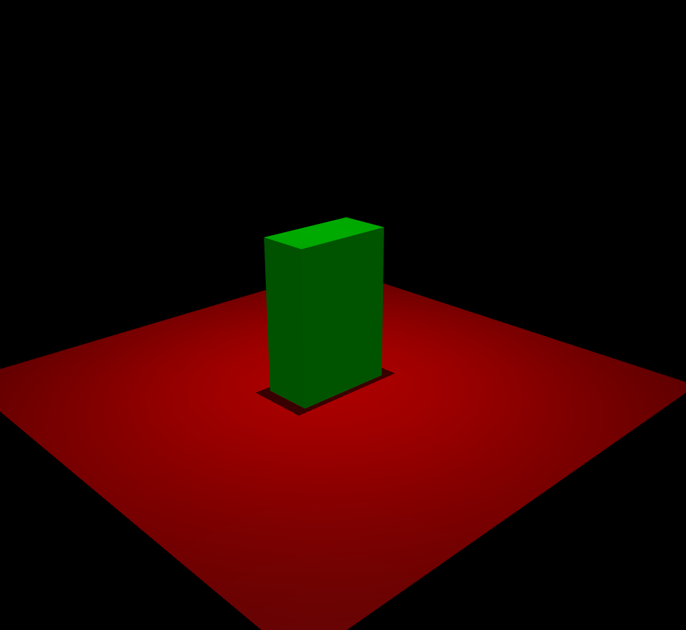

# Mujoco Model Instance

> [Mujoco 的模型实例python](https://mujoco.readthedocs.io/en/stable/overview.html#model-instances)


mujoco中模型本质都是xml文件，支持MJCF和URDF的格式。

|            | High level           | Low level          |
| ---------- | -------------------- | ------------------ |
| **File**   | MJCF/URDF (XML)      | MJB (binary)       |
| **Memory** | mjCModel (C++ class) | mjModel (C struct) |

所有的模型最后都会被mujoco处理成底层的`mjModel`的话，有点过于不经济（mjModel可以被存储为二进制文件，但被编译成二进制后不能还原）。于是按照上图，mujoco使用了两个level的modeling过程。


C++的mjCModel和xml文件（MJCF）定义的模型基本是直接对应的。在对xml定义的模型进行处理时，编译器将MJCF或URDF处理成mjCModel类型，同时user也可以自己用C++编写mjCModel，保存成MJCF。（官方说因为一些blabla的原因，暂时不支持编写C++的mjCModel再转换成MJCF）


## Examples

**通过PyPi安装mujoco**

如果只需要使用mujoco python binding，`pip install mujoco`即可。


- 创建`example_1.xml`模型：


```xml
<mujoco>
  <worldbody>
    <light diffuse=".5 .5 .5" pos="0 0 3" dir="0 0 -1"/>
    <geom type="plane" size="1 1 0.1" rgba=".9 0 0 1"/>
    <body pos="0 0 1">
      <joint type="free"/>
      <geom type="box" size=".1 .2 .3" rgba="0 .9 0 1"/>
    </body>
  </worldbody>
</mujoco>
```

在终端进行下面的操作，启动python binding提供的mujoco viewer:

```python
python -m mujoco.viewer
```


随后把xml定义的模型文件拖到viewer的窗口中......



- 创建`example_2.xml`模型：

```xml
<mujoco>
  <worldbody>
    <body pos="0 0 0">
      <geom type="sphere" size=".1" rgba=".9 .9 .1 1"/>
      <geom type="capsule" pos="0 0 .1" size=".02 .05" rgba=".9 .9 .1 1"/>
      <site type="box" pos="0 -.1 .3" size=".02 .02 .02" rgba=".9 .1 .9 1"/>
      <site type="ellipsoid" pos="0 .1 .3" size=".02 .03 .04" rgba=".9 .1 .9 1"/>
    </body>
  </worldbody>
</mujoco>
```

打开viewer，把模型拖入......


- 创建`example_3.xml`模型：

```xml
<mujoco model="example">
  <default>
    <geom rgba=".8 .6 .4 1"/>
  </default>

  <asset>
    <texture type="skybox" builtin="gradient" rgb1="1 1 1" rgb2=".6 .8 1" width="256" height="256"/>
  </asset>

  <worldbody>
    <light pos="0 1 1" dir="0 -1 -1" diffuse="1 1 1"/>
    <body pos="0 0 1">
      <joint type="ball"/>
      <geom type="capsule" size="0.06" fromto="0 0 0  0 0 -.4"/>
      <body pos="0 0 -0.4">
        <joint axis="0 1 0"/>
        <joint axis="1 0 0"/>
        <geom type="capsule" size="0.04" fromto="0 0 0  .3 0 0"/>
        <body pos=".3 0 0">
          <joint axis="0 1 0"/>
          <joint axis="0 0 1"/>
          <geom pos=".1 0 0" size="0.1 0.08 0.02" type="ellipsoid"/>
          <site name="end1" pos="0.2 0 0" size="0.01"/>
        </body>
      </body>
    </body>

    <body pos="0.3 0 0.1">
      <joint type="free"/>
      <geom size="0.07 0.1" type="cylinder"/>
      <site name="end2" pos="0 0 0.1" size="0.01"/>
    </body>
  </worldbody>

  <tendon>
    <spatial limited="true" range="0 0.6" width="0.005">
      <site site="end1"/>
      <site site="end2"/>
    </spatial>
  </tendon>
</mujoco>
```

打开viewer，把模型拖入......


## Dive into mujoco model

见官网（写得详细）

Intro：https://mujoco.readthedocs.io/en/stable/overview.html#model-instances

详细介绍：

https://mujoco.readthedocs.io/en/stable/modeling.html

https://mujoco.readthedocs.io/en/stable/XMLreference.html