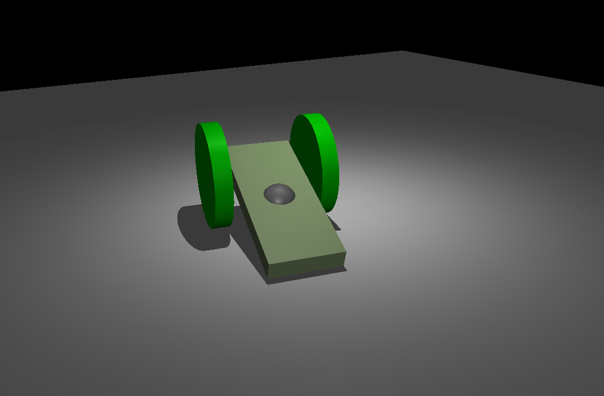
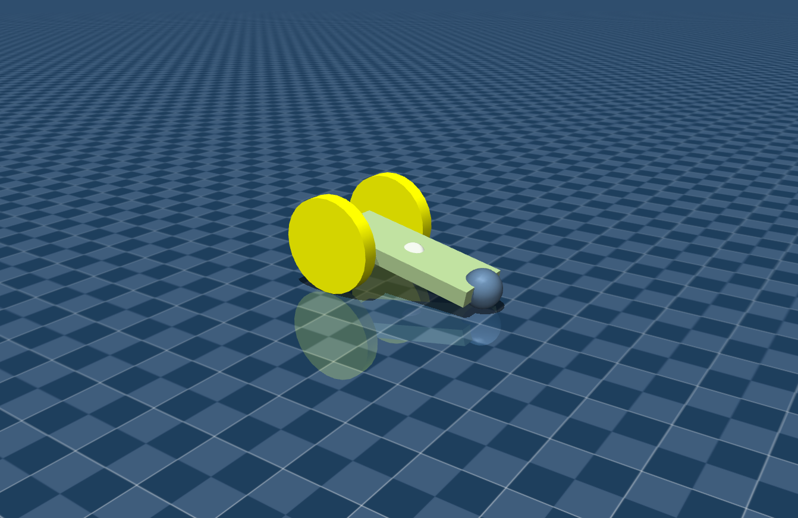

# Mujoco Python Bindings

> [Mujoco的python接口](https://mujoco.readthedocs.io/en/stable/python.html)
>
> 在python中使用mujoco


mujoco在被DeepMind收购并开源后，推出了原生的python接口，这意味我们可以愉快得使用python进行mujoco相关的工作了。在此之前，openai开发了一套mujoco的python接口`mujoco_py`，在DeepMind官方发布原生的python binding后，openai就暂停了对`mujoco_py`的维护；


据mujoco开发人员所说，如果你使用C/C++进行mujoco进行开发工作，你的体验会爽上天。因为python只是相当于是一个接口，实际底层运行的还是C/C++，并且python在多线程上有先天性的劣势。

（但笔者目前写C/C++的水平相比python菜得扣jio，python就是我大爹！）


## Python中直接调用viewer

> mujoco中的viewer相当于一个官方提供的GUI，提供了一个基本的画面渲染和操作界面；
>
> mujoco本质上是一个仿真引擎，所以你也可以自己开发自己的GUI，使用更好的渲染工具。比如mujoco官方就提供了unity的接口，让用户可以通过mujoco引擎仿真，在unity中渲染画面


下面是一个使用python binding的示例代码：

```python
import time

import mujoco
import mujoco.viewer

m = mujoco.MjModel.from_xml_path('example_3.xml')
d = mujoco.MjData(m)

with mujoco.viewer.launch_passive(m, d) as viewer:
  # Close the viewer automatically after 30 wall-seconds.
  start = time.time()
  while viewer.is_running() and time.time() - start < 30:
    step_start = time.time()

    # mj_step can be replaced with code that also evaluates
    # a policy and applies a control signal before stepping the physics.
    mujoco.mj_step(m, d)

    # Example modification of a viewer option: toggle contact points every two seconds.
    with viewer.lock():
      viewer.opt.flags[mujoco.mjtVisFlag.mjVIS_CONTACTPOINT] = int(d.time % 2)

    # Pick up changes to the physics state, apply perturbations, update options from GUI.
    viewer.sync()

    # Rudimentary time keeping, will drift relative to wall clock.
    time_until_next_step = m.opt.timestep - (time.time() - step_start)
    if time_until_next_step > 0:
      time.sleep(time_until_next_step)
```

第六行的模型我用的上一章的[example_3.xml](../Models_in_Mujoco/example_3.xml)，把模型和上面的python脚本文件放在同一个文件夹里（或指定模型的路径）


运行这个python脚本，运行效果其实和我们单独打开viewer再把模型手动拖入一样；


同时你也可以自己定义符合自己审美和使用习惯的GUI，这里不过多作介绍，网上也有相关的开源代码（官方的viewer除了丑点还是挺好用的）。


**Tips:**

> 使用pycharm有mujoco python binding的代码提示，避免重复翻阅官方文档查找API。


## 小例子

### Example 1:


- 创建模型文件`differential_drive.xml`

```xml
<mujoco>
    <option gravity="0 0 -9.81"/>
    
    <worldbody>
        <light diffuse=".5 .5 .5" pos="0 0 3" dir="0 0 -1"/>
        <geom type="plane" size="5 5 .1" rgba=".9 .9 .9 1"/>
        <body name="chasis" pos="0 0 1" euler='0 90 0'>
            <joint type="free"/>
            <geom type="box" size=".05 .2 .5" rgba=".6 .7 .5 1"/>
            <site name="marker" pos="0 0 0" size="0.1"/>

            <body name="wheel_body_left" pos="0 0.3 -0.3" euler="90 0 0">
                <joint name="wheel_left" type="hinge" axis="0 0 -1"/>
                <geom type="cylinder" size=".3 0.05" rgba="0 .9 0 1"/>
            </body>
            <body name="wheel_body_right" pos="0 -0.3 -0.3" euler="90 0 0">
                <joint name="wheel_right" type="hinge" axis="0 0 -1"/>
                <geom type="cylinder" size=".3 0.05" rgba="0 .9 0 1"/>
            </body>

        </body>
    </worldbody>

    <actuator>
        <velocity name="left_servo" joint="wheel_left" kv="100"/>
        <velocity name="right_servo" joint="wheel_right" kv="100"/>
    </actuator>

    <sensor>
        <framepos objtype="site" objname="marker"/>
    </sensor>
           
</mujoco>
```


- 创建python脚本：

```python
import mujoco as mj  # import mujoco
from mujoco.glfw import glfw  # GLFW是一个开源的跨平台库，用于创建窗口、上下文和处理用户输入
import numpy as np
import os
from scipy.spatial.transform import Rotation as R


xml_path = 'differential_drive.xml' #xml file (assumes this is in the same folder as this file)
simend = 10 #simulation time
print_camera_config = 0 # 设置为1，在仿真时会答应摄像头参数，方便初始化一个自己喜欢的视角
                        # set to 1 to print camera config
                        # this is useful for initializing view of the model)

# For callback functions
button_left = False
button_middle = False
button_right = False
lastx = 0
lasty = 0

def quat2euler(quat_mujoco):
    # mujoco quat is (costant, x, y, z)
    # scipy quat is (x, y, z, costant)
    quat_scipy = np.array([quat_mujoco[3], quat_mujoco[0], quat_mujoco[1], quat_mujoco[2]])

    r = R.from_quat(quat_scipy)
    euler = r.as_euler('xyz', degrees=True)

    return euler

def init_controller(model,data):
    #initialize the controller here. This function is called once, in the beginning
    pass

def controller(model, data):
    #put the controller here. This function is called inside the simulation.
    data.ctrl[0] = 1
    data.ctrl[1] = -1
    

def keyboard(window, key, scancode, act, mods):
    if act == glfw.PRESS and key == glfw.KEY_BACKSPACE:
        mj.mj_resetData(model, data)
        mj.mj_forward(model, data)

def mouse_button(window, button, act, mods):
    # update button state
    global button_left
    global button_middle
    global button_right

    button_left = (glfw.get_mouse_button(
        window, glfw.MOUSE_BUTTON_LEFT) == glfw.PRESS)
    button_middle = (glfw.get_mouse_button(
        window, glfw.MOUSE_BUTTON_MIDDLE) == glfw.PRESS)
    button_right = (glfw.get_mouse_button(
        window, glfw.MOUSE_BUTTON_RIGHT) == glfw.PRESS)

    # update mouse position
    glfw.get_cursor_pos(window)

def mouse_move(window, xpos, ypos):
    # compute mouse displacement, save
    global lastx
    global lasty
    global button_left
    global button_middle
    global button_right

    dx = xpos - lastx
    dy = ypos - lasty
    lastx = xpos
    lasty = ypos

    # no buttons down: nothing to do
    if (not button_left) and (not button_middle) and (not button_right):
        return

    # get current window size
    width, height = glfw.get_window_size(window)

    # get shift key state
    PRESS_LEFT_SHIFT = glfw.get_key(
        window, glfw.KEY_LEFT_SHIFT) == glfw.PRESS
    PRESS_RIGHT_SHIFT = glfw.get_key(
        window, glfw.KEY_RIGHT_SHIFT) == glfw.PRESS
    mod_shift = (PRESS_LEFT_SHIFT or PRESS_RIGHT_SHIFT)

    # determine action based on mouse button
    if button_right:
        if mod_shift:
            action = mj.mjtMouse.mjMOUSE_MOVE_H
        else:
            action = mj.mjtMouse.mjMOUSE_MOVE_V
    elif button_left:
        if mod_shift:
            action = mj.mjtMouse.mjMOUSE_ROTATE_H
        else:
            action = mj.mjtMouse.mjMOUSE_ROTATE_V
    else:
        action = mj.mjtMouse.mjMOUSE_ZOOM

    mj.mjv_moveCamera(model, action, dx/height,
                      dy/height, scene, cam)

def scroll(window, xoffset, yoffset):
    action = mj.mjtMouse.mjMOUSE_ZOOM
    mj.mjv_moveCamera(model, action, 0.0, -0.05 *
                      yoffset, scene, cam)

#get the full path
dirname = os.path.dirname(__file__)
abspath = os.path.join(dirname + "/" + xml_path)
xml_path = abspath

# MuJoCo data structures
model = mj.MjModel.from_xml_path(xml_path)  # MuJoCo model
data = mj.MjData(model)                # MuJoCo data
cam = mj.MjvCamera()                        # Abstract camera
opt = mj.MjvOption()                        # visualization options

# Init GLFW, create window, make OpenGL context current, request v-sync
glfw.init()
window = glfw.create_window(1200, 900, "Differential Drive Car", None, None)
glfw.make_context_current(window)
glfw.swap_interval(1)

# initialize visualization data structures
mj.mjv_defaultCamera(cam)
mj.mjv_defaultOption(opt)
scene = mj.MjvScene(model, maxgeom=10000)
context = mj.MjrContext(model, mj.mjtFontScale.mjFONTSCALE_150.value)

# install GLFW mouse and keyboard callbacks
glfw.set_key_callback(window, keyboard)
glfw.set_cursor_pos_callback(window, mouse_move)
glfw.set_mouse_button_callback(window, mouse_button)
glfw.set_scroll_callback(window, scroll)

# Example on how to set camera configuration
cam.azimuth = 90
cam.elevation = -45
cam.distance = 2
# cam.lookat = np.array([0.0, 0.0, 0])


#initialize the controller
init_controller(model,data)

#set the controller
mj.set_mjcb_control(controller)

# The Main Simulation Loop
while not glfw.window_should_close(window):
    time_prev = data.time

    while (data.time - time_prev < 1.0/60.0):
        mj.mj_step(model, data)

    # x, y, z position of the car
    # print(data.qpos[0], data.qpos[1], data.qpos[2])

    # roll, pitch, yaw of the car
    # quat = np.array([data.qpos[3], data.qpos[4], data.qpos[5], data.qpos[6]])
    # euler = quat2euler(quat)
    # print('roll: ' + str(euler[0]) + " pitch: " + str(euler[1]) + "yaw: " + str(euler[2]))

    # 和上面的不同，对模型增加了传感器之后，直接采集传感器的数据
    print(data.site_xpos[0])

    if (data.time>=simend):
        break

    # get framebuffer viewport
    viewport_width, viewport_height = glfw.get_framebuffer_size(
        window)
    viewport = mj.MjrRect(0, 0, viewport_width, viewport_height)

    #print camera configuration (help to initialize the view)
    if (print_camera_config==1):
        print('cam.azimuth =',cam.azimuth,';','cam.elevation =',cam.elevation,';','cam.distance = ',cam.distance)
        print('cam.lookat =np.array([',cam.lookat[0],',',cam.lookat[1],',',cam.lookat[2],'])')

    # Update scene and render
    mj.mjv_updateScene(model, data, opt, None, cam,
                       mj.mjtCatBit.mjCAT_ALL.value, scene)
    mj.mjr_render(viewport, scene, context)

    # swap OpenGL buffers (blocking call due to v-sync)
    glfw.swap_buffers(window)

    # process pending GUI events, call GLFW callbacks
    glfw.poll_events()

glfw.terminate()
```


以上代码相当于自己定义了一个UI，模型是一个差速小车，输入左右轮的运动指令使小车运动；




### Example 2:

- 把模型改好看一点`diff_drive.xml`：

```xml
<mujoco>
    <option gravity="0 0 -9.81"/>
    
    <asset>
        <texture type="skybox" builtin="gradient" rgb1="0.3 0.5 0.7" rgb2="0 0 0" width="512" height="3072"/>
        <texture type="2d" name="groundplane" builtin="checker" mark="edge" rgb1="0.2 0.3 0.4" rgb2="0.1 0.2 0.3" markrgb="0.8 0.8 0.8" width="300" height="300"/>
        <material name="groundplane" texture="groundplane" texuniform="true" texrepeat="5 5" reflectance="0.2"/>
    </asset>
    
    <visual>
   	    <headlight diffuse="0.6 0.6 0.6"  ambient="0.3 0.3 0.3" specular="0 0 0"/>
        <rgba haze="0.15 0.25 0.35 1"/>
        <global azimuth="120" elevation="-20"/>
    </visual>
    
    <worldbody>
        <light pos="0 -0.2 1" dir="0 0.2 -0.8" directional="true"/>
        <geom name="floor" size="0 0 0.05" type="plane" material="groundplane"/>
        
        <body name="diff_drive_car" pos="0 0 1" euler='0 90 0'>
            <joint type="free"/>
            <geom type="box" size=".05 .2 .5" rgba=".6 .7 .5 1"/>
            <site name="marker" pos="0 0 0" size="0.08" rgba="0.9 0.9 0.9 0.6"/>
            <geom type="sphere" pos="0 0 0.5" size="0.12" rgba="0.3 0.4 0.5 1"/>

            <body name="wheel_body_left" pos="0 0.3 -0.4" euler="90 0 0">
                <joint name="wheel_left" type="hinge" axis="0 0 -1"/>
                <geom type="cylinder" size=".3 0.05" rgba=".9 .9 0 1"/>
            </body>
            
            <body name="wheel_body_right" pos="0 -0.3 -0.4" euler="90 0 0">
                <joint name="wheel_right" type="hinge" axis="0 0 -1"/>
                <geom type="cylinder" size=".3 0.05" rgba=".9 .9 0 1"/>
            </body>
        </body>
    </worldbody>

    <actuator>
        <velocity name="left_servo" joint="wheel_left" kv="100"/>
        <velocity name="right_servo" joint="wheel_right" kv="100"/>
    </actuator>

    <sensor>
        <framepos objtype="site" objname="marker"/>
    </sensor>
       
</mujoco>
```


- 创建python脚本，这次我们就直接使用viewer：

```python
def init_viewer_cam(mujoco_viewer, azimuth, elevation, distance):
    mujoco_viewer.cam.azimuth = azimuth
    mujoco_viewer.cam.elevation = elevation
    mujoco_viewer.cam.distance = distance


def print_cam_config(mujoco_viewer):
    print("cam config -- azimuthmu: " + str(mujoco_viewer.cam.azimuth) + " elevation: " + str
    (mujoco_viewer.cam.elevation) +
          " distance: " + str(mujoco_viewer.cam.distance))


if __name__ == '__main__':
    import mujoco
    import mujoco.viewer
    from pynput import keyboard
    xml_path = './assets/my_models/diff_drive.xml'
    model = mujoco.MjModel.from_xml_path(xml_path)
    data = mujoco.MjData(model)


    def on_press(key):
        print(f'{key} is pressed.')
        speed = 1
        if key == keyboard.Key.up:
            data.ctrl[0] = speed
            data.ctrl[1] = speed
        if key == keyboard.Key.down:
            data.ctrl[0] = -speed
            data.ctrl[1] = -speed
        if key == keyboard.Key.left:
            data.ctrl[0] = -speed
            data.ctrl[1] = speed
        if key == keyboard.Key.right:
            data.ctrl[0] = speed
            data.ctrl[1] = -speed
        if key == keyboard.Key.space:
            data.ctrl[0] = 0
            data.ctrl[1] = 0


    listener = keyboard.Listener(on_press=on_press)
    listener.start()

    with mujoco.viewer.launch_passive(model, data) as viewer:
        init_viewer_cam(mujoco_viewer=viewer, azimuth=112, elevation=-32, distance=9)

        while viewer.is_running():
            # print_cam_config(viewer)
            mujoco.mj_step(model, data)
            print(data.qpos)
            

            # Pick up changes to the physics state, apply perturbations, update options from GUI.
            viewer.sync()

```


运行脚本，通过上下左右和空格键，可以控制小车的运动；




